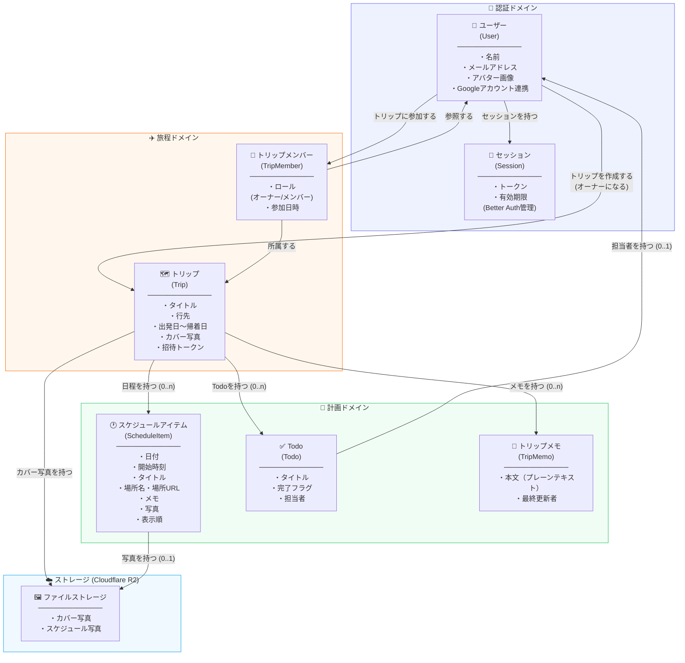
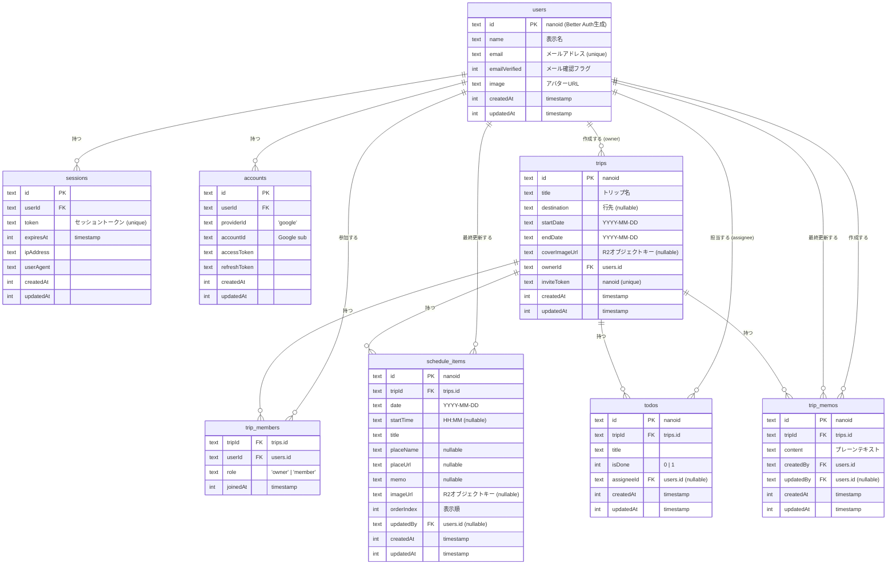

# ドメイン概念図 & ER図

> アプリ: 旅程管理アプリ  
> 作成日: 2026-06-06

---

## 1. ドメイン概念図



---

## 2. ER図



---

## 3. 主要な設計判断の補足

### 複合主キー (trip_members)
`trip_members` は `(tripId, userId)` の複合主キー。同一ユーザーが同一トリップに重複参加できない制約をDBレベルで保証する。

### trip_memos（付箋メモ）
1トリップに複数のメモ（付箋）を持てるよう `id` を PK にし、`tripId` は通常の FK として持つ。
`createdBy`（作成者、not null）と `updatedBy`（最終更新者、nullable）の両方を持ち、
編集はトリップメンバー全員に許可、削除は `createdBy` 本人のみに制限するアプリ側の権限判定に使う。

### inviteToken の分離
招待トークンは `trips` テーブルに持たせる。トリップIDとは独立した nanoid にすることで、トークンを再生成してもトリップIDは不変に保てる。

### updatedBy の nullable
スケジュールアイテム・メモの `updatedBy` は nullable。システム側から初期生成した場合やオーナーが自身で作成した直後など、更新者情報が不要なケースに対応する。

### Better Auth テーブルの ownership
`users` / `sessions` / `accounts` は Better Auth が DDL を自動生成・管理する。Drizzle スキーマには参照用として記述するが、マイグレーション対象外とする（`drizzle-kit` の `tablesFilter` で除外）。
```
